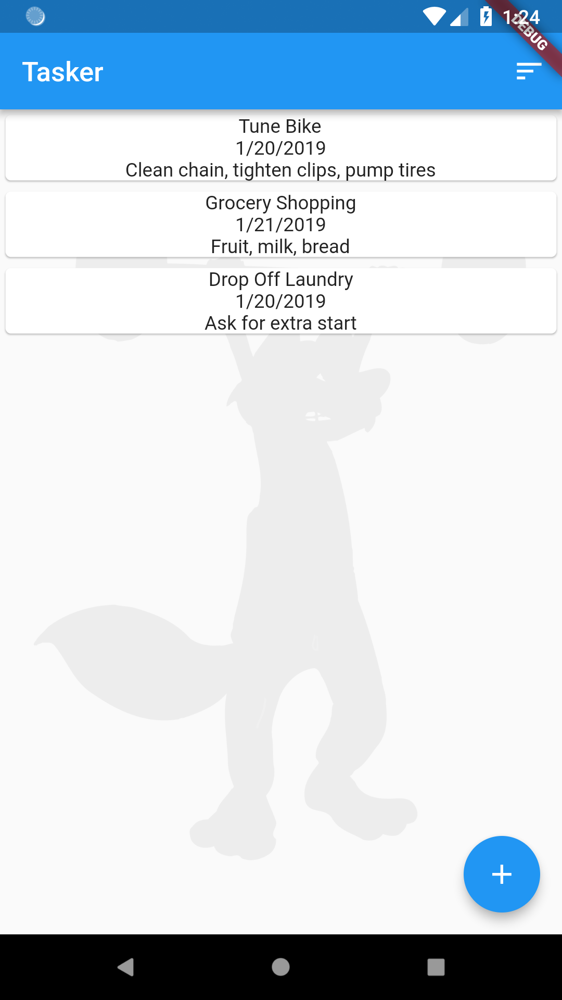
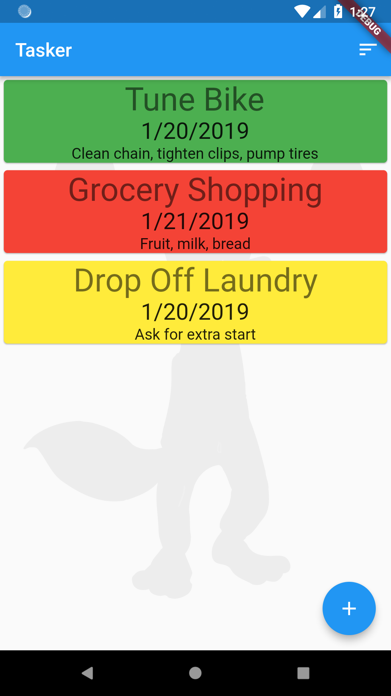

# Supply Your Own Widgets
## TOC
 * [Introduction to Rapido](./introduction.md)
 * [1: Make a complete app with a few lines of code](./flutter_app_in_few_lines.md)
 * [2: Brand and light customization](./customize_flutter_app.md)
 * 3: Providing your own widgets
 * [4: Adding maps and location](./flutter_maps_and_location.md)
 * [5: Adding images](./flutter_images.md)
 * [6: Document and DocumentList](./rapido_documents.md)
 * [Full Code Example](./main.md)

This is part 3 of the getting started with Rapido tutorial. If you haven't looked through [part 1](flutter_app_in_few_lines.md) and [part 2](customize_flutter_app.md) you might want to at least go back and skim those so this part makes sense.

## Starting Point
At this point, we have a functioning application, and we have applied some branding:  


We've hardly had to write any code to get to this point, because Rapido supplies default implementation for almost all the UI you need. For example, Rapido provides a default ListTile to display in the [DocumentListView](https://pub.dartlang.org/documentation/rapido/latest/documents/DocumentListView-class.html) that comes with the DocumentListScaffold.

Rapido makes it easy to supply your own widgets.

## customItemBuilder
The [DocumentListView](https://pub.dartlang.org/documentation/rapido/latest/documents/DocumentListView-class.html), and by extension the [DocumentListScaffold](https://pub.dartlang.org/documentation/rapido/latest/documents/DocumentListScaffold-class.html), have a customItemBuilder property. This property is a function that returns a widget build for each document in the list. In this way, you can write a function to replace the default ListTile. Note that if you supply a customItemBuilder function, the titleFields and subtitleField properties are ignored.

We'll start with a very simple customWidgetBuilder:  
```dart
  Widget customItemBuilder(int index, Document doc, BuildContext context){
        return Text(doc["title"]);
  }
  ```
This function is called for each item in the [DocumentList](https://pub.dartlang.org/documentation/rapido/latest/documents/DocumentList-class.html), and returns a Text with the title as the text.

Of course, we need to set the customItemBuilder proprty to use it:
```dart
  @override
  Widget build(BuildContext context) {
    return DocumentListScaffold(
      documentList,
      decoration: BoxDecoration(
        image: DecorationImage(
          image: AssetImage("assets/background.jpg"),
          colorFilter: ColorFilter.mode(
              Colors.white.withOpacity(0.05), BlendMode.dstATop),
        ),
      ),
      emptyListWidget: Center(
        child: Text("Click the add button to create your first task"),
      ),
      customItemBuilder: customItemBuilder,
    );
  }

  Widget customItemBuilder(int index, Document doc, BuildContext context) {
    return Text(doc["title"]);
  }
  ```
Notice that the customItemBuilder passes in a Document object. As discussed in [the introduction](introduction.md), a Document is Map of Strings to dynamics, along with some other functionality. As you can see in the code above, you can access the fields in the Document as easily as accessing the fields in a Map.

It's working, but, of course, much worse than the default:  


## Build a Card
You can return any widget that you want from customItemBuilder. For this tutorial, we'll a Card for each item. And we'll put a column in each Card. Then we will use Text widgets to display the title, date, and notes.

```dart
  Widget customItemBuilder(int index, Document doc, BuildContext context) {
    return Card(
      child: Column(
        children: <Widget>[
          Text(doc["title"]),
          Text(doc["date"]),
          Text(doc["note"])
        ],
      ),
    );
  }
  ```
This cleans it up quite a bit:  


We can use the applications text them to enhance the display some:  
```dart
  Widget customItemBuilder(int index, Document doc, BuildContext context) {
    TextTheme textTheme = Theme.of(context).textTheme;

    return Card(
      child: Column(
        children: <Widget>[
          Text(
            doc["title"],
            style: textTheme.display1,
          ),
          Text(
            doc["date"],
            style: textTheme.headline,
          ),
          Text(
            doc["note"],
            style: textTheme.subhead,
          )
        ],
      ),
    );
  }
```
This results in a slightly more nicely styled Card:  


## Set the Card Color Dynamically
Notice that we are not displaying the pri count field at all. We can use the customItemBuilder function to set the color of the Card, based on the priority in the Document. We could do many other things, like choose an icon based on the priority, etc... But we will stick with just setting the color.

First, let's implement a simple function to return colors based on the priority of the tasks:
```dart
  Color getCardColor(Document doc) {
    int priority = doc["pri count"];
    if (priority < 3) return Colors.red;
    if (priority < 6) return Colors.yellow;
    return Colors.green;
  }
  ```
  Then when we create the Card, we just use this function to set the color:  
  ```dart
    return Card(
      color: getCardColor(doc),
    ...
  ```
Now the Card color gets set based on the priority:  


## Use DocumentActionsButton
One important thing to note at this point, is that the UI that we have not replaced (the AddDocumentFloatingActionButto, and the DocumentListSortButton) still work perfectly.

However, when we replaced the default ListTile, we lost the [DocumentActionsButton](https://pub.dartlang.org/documentation/rapido/latest/documents/DocumentActionsButton-class.html) which allows the user to edit or delete a task. We could add our own custom UI for this, and use the functions in Document and [DocumentList](https://pub.dartlang.org/documentation/rapido/latest/documents/DocumentList-class.html). However, all of the different UI elements in Rapido are designed so you can mix and match them with your own widgets. 

So, let's just add a [DocumentActionsButton](https://pub.dartlang.org/documentation/rapido/latest/documents/DocumentActionsButton-class.html) to each Card. To do this, we just have to tell the [DocumentActionsButton](https://pub.dartlang.org/documentation/rapido/latest/documents/DocumentActionsButton-class.html) widget two things, the [DocumentList](https://pub.dartlang.org/documentation/rapido/latest/documents/DocumentList-class.html) to act on, and the index of the Document in that [DocumentList](https://pub.dartlang.org/documentation/rapido/latest/documents/DocumentList-class.html). The index is passed into the customItemBuilder function, so we can just pass it along.
```dart
         DocumentActionsButton(documentList, index: index)
```
The full function now looks like this:
```dart
  Widget customItemBuilder(int index, Document doc, BuildContext context) {
    TextTheme textTheme = Theme.of(context).textTheme;

    return Card(
      color: getCardColor(doc),
      child: Column(
        children: <Widget>[
          Text(
            doc["title"],
            style: textTheme.display1,
          ),
          Text(
            doc["date"],
            style: textTheme.headline,
          ),
          Text(
            doc["note"],
            style: textTheme.subhead,
          ),
          DocumentActionsButton(documentList, index: index)
        ],
      ),
    );
  }
```
And it "just works":  


# Summary
In this section, we dove into how to create custom widgets. In the [next section](flutter_maps_and_location.md), we will show how to include location and mapping functionality.