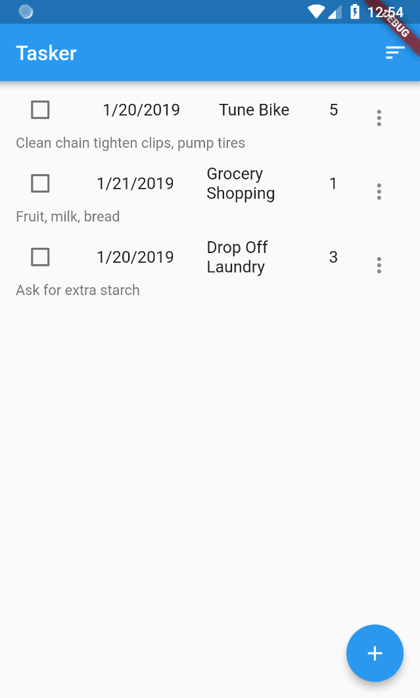
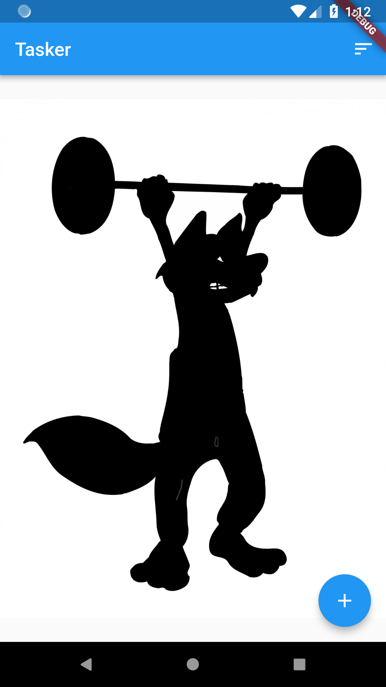
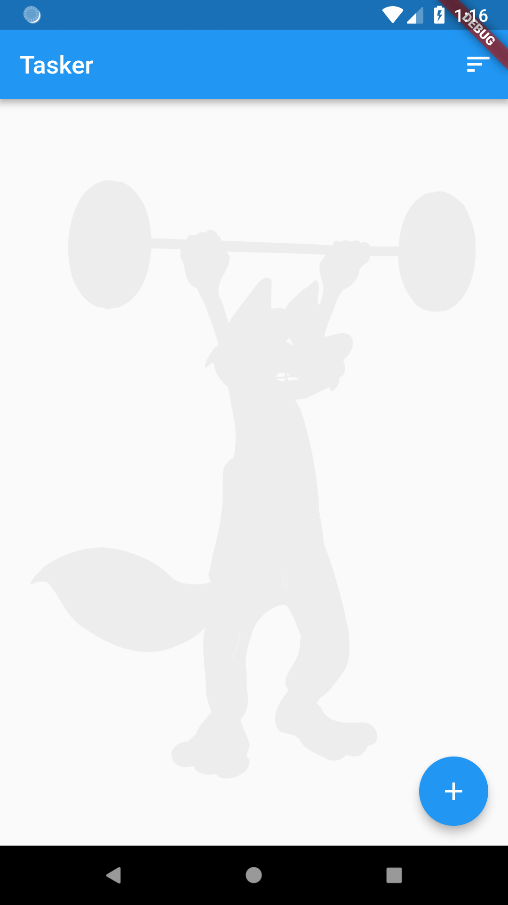

# Customize Your Look and Feel
## TOC
 * [Introduction to Rapido](./introduction.md)
 * [1: Make a complte app with a few lines of code](./flutter_app_in_few_lines.md)
 * 2: Brand and light customization
 * [3: Providing your own widgets](./custom_flutter_widgets.md)
 * [4: Adding maps and location](./flutter_maps_and_location.md)
 * [Full Code Example](./main.md)

This is part 2 of the getting started with Rapido tutorial. If you haven't looked through [part 1](flutter_app_in_few_lines.md) you might want to at least go back and skim that so this part makes sense.

## Starting Point
We've created an app called Tasker with Rapido. So we have a functional Task list application:  


While functional, it could use some sprucing up. In this part of the tutorial we will add a background image, and add a prompt to display in case the [DocumentListView](https://pub.dartlang.org/documentation/rapido/latest/documents/DocumentListView-class.html) is empty.

## Add a Background Image to Your Project
Here we will cover the steps necessary to use an image in your Flutter project.

### Create and use an Assets Directory 
Inside your application directory, create a directory called "assets." I use the CLI for this:  

```
$ mkdir assets
$ ls
README.md	assets		ios		pubspec.lock	tasker.iml
android		build		lib		pubspec.yaml	test
```
Then, add your background image into that directory. I will use the following image because it was available with a free license, and I just like it for some reason:  


I make sure it is in my assets directory:  
```
$ ls assets/
background.jpg
```
### Add a reference to the image in pubspec.yaml
The flutter tools don't particularly care what is in that assets directory at this point. You have to tell flutter to actually use the image by adding a refernece to it in your pubspec.yaml file. 

This can be tricky because YAML can play tricks on you. The Flutter developers try to help you out by highlighting where to add the reference in pubspec.yaml:  
```
  # To add assets to your application, add an assets section, like this:
  # assets:
  #  - images/a_dot_burr.jpeg
  #  - images/a_dot_ham.jpeg
```

So I change it to look like this:  
```
  # To add assets to your application, add an assets section, like this:
  assets:
   - assets/background.jpg
```
It's very important that "assets" is indendeted 2 spaces, and the 
"- assets/background.jpg" is indented 4 spaces. Otherwise flutter will not be able to find the image.

### Add the BoxDecorations
[DocumentListScaffold](https://pub.dartlang.org/documentation/rapido/latest/documents/DocumentListScaffold-class.html) lets you pass in BoxDecoration, and will display that as part of the Scaffold. We will use this to display our backgound.jpg image. BoxDecoration is a very powerful feature in Flutter for decorating Containers. You can use it to add background colors, borders, background images, etc... As a result, it can be slightly complicated to use. 

We want to add a background image, so will use a DecorationImage to display an image in the BoxDecoration, and then use an AssetImage to load a local asset into the DecorationImage. So, the build code should like this:  
```
  @override
  Widget build(BuildContext context) {
    return DocumentListScaffold(
      documentList,
      titleKeys: ["date", "title", "pri count"],
      subtitleKey: "note",
      decoration: BoxDecoration(
        image: DecorationImage(
          image: AssetImage("assets/background.jpg"),
        ),
      ),
    );
  }
  ```
This code then adds the BoxDecoration:  


### Add the Filter
So, it worked, but of course the black image makes the app impossible to read and use. This can be worked around in multiple ways. For example, by editng the image directly. We will use the powerful ColorFilter class to an almost opaque white overlay on top of the image:  
```
  @override
  Widget build(BuildContext context) {
    return DocumentListScaffold(
      documentList,
      titleKeys: ["date", "title", "pri count"],
      subtitleKey: "note",
      decoration: BoxDecoration(
        image: DecorationImage(
          image: AssetImage("assets/background.jpg"),
          colorFilter: ColorFilter.mode(
              Colors.white.withOpacity(0.05), BlendMode.dstATop),
        ),
      ),
    );
  }
  ```
This makes the application readable while applying a bit of branding:  


### Add the emptyListWidget
When the list is empty, the app is a little boring, even if the background is visible.:  


[DocumentListView](https://pub.dartlang.org/documentation/rapido/latest/documents/DocumentListView-class.html), and by extension [DocumentListScaffold](https://pub.dartlang.org/documentation/rapido/latest/documents/DocumentListScaffold-class.html) supports a property called "emptyListWidget." This widget will display whenever the list is empty. You can pass in any widget you like. For our purposes, we will add some centered text.

```
  @override
  Widget build(BuildContext context) {
    return DocumentListScaffold(
      documentList,
      titleKeys: ["date", "title", "pri count"],
      subtitleKey: "note",
      decoration: BoxDecoration(
        image: DecorationImage(
          image: AssetImage("assets/background.jpg"),
          colorFilter: ColorFilter.mode(
              Colors.white.withOpacity(0.05), BlendMode.dstATop),
        ),
      ),
      emptyListWidget: Center(
        child: Text("Click the add button to create your first task"),
      ),
    );
  }
  ```
  Again, the emptyListWidget can be as complex and fancy as you like. In this case, we are keeping it simple:  
  

# Summary
In this part of the tutorial we added a backgfound image to the [DocumentListScaffold](https://pub.dartlang.org/documentation/rapido/latest/documents/DocumentListScaffold-class.html), and we added a widget to display when the [DocumentListView](https://pub.dartlang.org/documentation/rapido/latest/documents/DocumentListView-class.html) was empty. In the [next part](custom_flutter_widgets.md) we will replace the default ListTiles with our own cards.