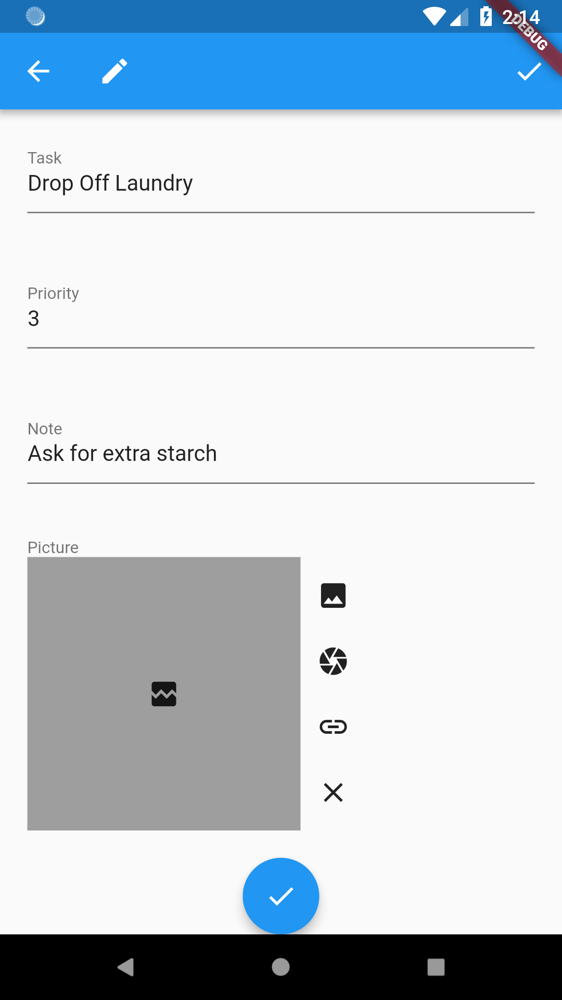
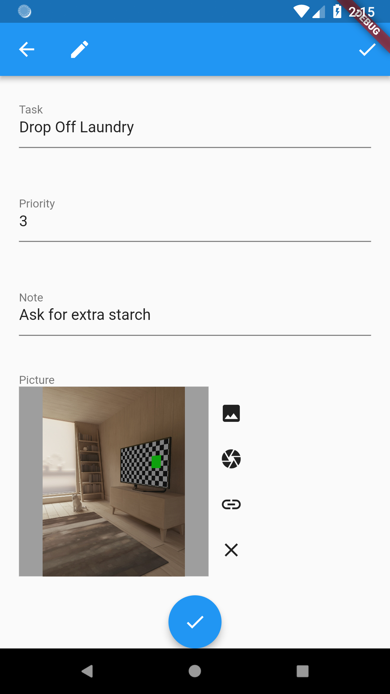
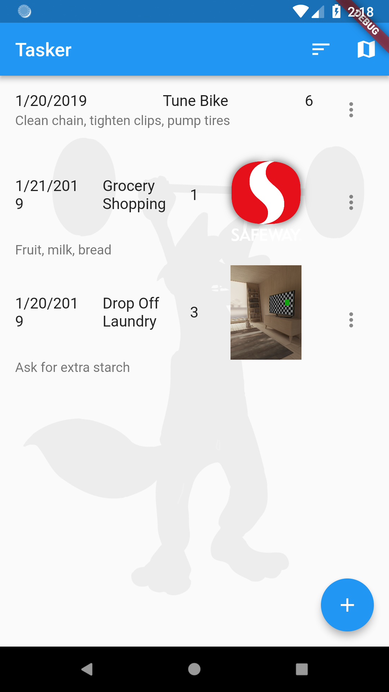

# Add Images
## TOC

 * [Introduction to Rapido](./introduction.md)
 * [1: Make a complete app with a few lines of code](./flutter_app_in_few_lines.md)
 * [2: Brand and light customization](./customize_flutter_app.md)
 * [3: Providing your own widgets](./custom_flutter_widgets.md)
 * [4: Adding maps and location](./flutter_maps_and_location.md)
 * 5: Add images
 * [6: Document and DocumentList](./rapido_documents.md)
 * [Full Code Example](./main.md)

This is part 5 of the getting started with Rapido tutorial. If you haven't looked through the previous parts, you might want to at least go back and skim those so this part makes sense.

In this section we will add an image to each task.

## Starting Point
We're going to rewind a bit, back to [ Part 2: Brand and light customization](./customize_flutter_app.md) and then go ahead and add images instead of location to each item. Using location and images together is absolutely fine and works perfectly well, but it'll keep the tutorial a little more simple if we don't mix them.

## Adding an Image Field
As you may have guessed by now, if you want to include images, you simply add a field name that ends in the word "image" to your list of labels in your [DocumentListView](https://pub.dartlang.org/documentation/rapido/latest/rapido/DocumentListView-class.html).

```dart
  DocumentList documentList = DocumentList(
    "Tasker",
    labels: {
      "Date": "date",
      "Task": "title",
      "Priority": "pri count",
      "Note": "subtitle",
      "Picture": "image"
    },
  );
```

Like "title", "siubtitle", "date", "count", and "latlong", "image" has semantic meaning in Rapido. It means that you want to store a string that points to an image, either a path on the device, or a URL to an image available on the web. Rapido can deal with paths or images just fine, as you will see.

## Picker UI
After closing the app and restarting it, if you create a new task or edit an existing one, you will see that there is a new picker in the DocumentForm:  


The image picker is blank because no image is selected by defaults. The buttons to the right are used to choose or clear the image. In order from the top, the user can choose an image from their phone's photo gallery, their phone's camera, or they can enter a URL that points to an image.

### Gallery and Camera Images
Tapping the gallery or camera icon button, will take the user through the android or iOS native UI for choosing from those sources. And, when done, will display an image in the image picker:  


Note that the Android Emulator provides both an emulated camera and an emulated gallery. That's what I am using in these screenshots. Don't worry, I tested on real devices, and it works fine.

Additionally, Rapido copies the images from the camera or gallery into the local application directory on the user's device for safe keeping.

### URL images
The URL picker is a little different because it expects the user to enter a string. So it pops up a dialog for the user to enter a URL: 


After the user enters the URL, the image picker "just works":  


## Default DocumentListView
The default [DocumentListView](https://pub.dartlang.org/documentation/rapido/latest/rapido/DocumentListView-class.html) "just works" as well. It infers that the field name ending in "image" should display and displays all three kinds of images: 


## TypedDisplayField
Rapido can render an appropriate widget for any field in a Document using the [TypedDisplayField](https://pub.dartlang.org/documentation/rapido/latest/rapido/TypedDisplayField-class.html) Widget. The way it works is simple. Give it the Document, field name, and size that you want to display, for example:

```dart
          TypedDisplayField(
            fieldName: "image",
            document: doc,
            boxSize: 200.00,
          ),
```

Again, based on the fieldName property, Rapido will know to present an image, whether the image is local or form a URL. Let's add back in our customItemBuilder from Part 2, but this time, let's add the image to it:

```dart
  Widget customItemBuilder(int index, Document doc, BuildContext context) {
    TextTheme textTheme = Theme.of(context).textTheme;

    return Card(
      color: getCardColor(doc),
      child: Column(
        children: <Widget>[
          Text(
            doc["title"],
            style: textTheme.display1,
          ),
          Text(
            doc["date"],
            style: textTheme.headline,
          ),
          TypedDisplayField(
            fieldName: "image",
            document: doc,
            boxSize: 200.00,
          ),
          Text(
            doc["subtitle"],
            style: textTheme.subhead,
          ),
          DocumentActionsButton(documentList, index: index)
        ],
      ),
    );
  }
  ```

Then when we do a hot reload, we see that the images are displayed:  


# Summary
This part showed how to add images to your application and how to use [TypedDisplayField](https://pub.dartlang.org/documentation/rapido/latest/rapido/TypedDisplayField-class.html) to show them in your own UI.
