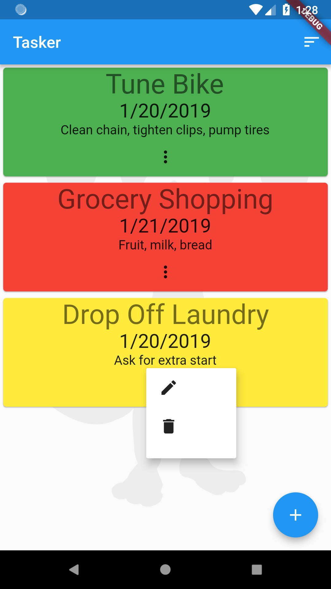

# Add Maps and Location
## TOC
 * [Introduction to Rapido](./introduction.md)
 * [1: Make a complte app with a few lines of code](./flutter_app_in_few_lines.md)
 * [2: Brand and light customization](./customize_flutter_app.md)
 * [3: Providing your own widgets](./custom_flutter_widgets.md)
 * 4: Adding maps and location
 * [Full Code Example](./main.md)

This is part 4 of the getting started with Rapido tutorial. If you haven't looked through the previous parts, you might want to at least go back and skim those so this part makes sense.

In this section we will add a map location to each task, and display a map with each entry.

## Starting Point
At this point we have a fully functional task application that has some of our branding and we've supplied some custom widgets for the individual task items. 


## Adding Your API Key
Currently, Rapido supports Google Maps by wrapping and simplifying the Google Maps Flutter Plugin. In order to use the location and mapping functionality, you will need to supply your own API key. This involves signing up for an API key from Google, and then adding the key to your AndroidManifest.xml file and your AppleDelegate.m file.

See the (Google Maps Flutter Plugin)[https://pub.dartlang.org/packages/google_maps_flutter#-readme-tab-] for the detailed instructions. 

## Adding a Map Point Field
In [part 1](flutter_app_in_few_lines.md) we defined the labels and by extension the fields, that we expect to include in the UI for Document. We will revisit that by adding a "map-point" field to each Document:
```
  DocumentList documentList = DocumentList("Tasker", labels: {
    "Task": "title",
    "Date": "date",
    "Priority": "pri count",
    "Note": "note",
    "Map Location" : "map_point"
  });
```
Like "date" and "count", "map_point" has semantic meaning in Rapido. It means that you want to store a point on a Map. (As an aside, there are other field names with semantic, such as "title," which you will see in a bit.)

## Picker UI
After closing the app, and restarting it, if we go through the UI and choose the edit button for a task, you will see that a new field is exposed, named "Map Location." This is expected because that is what we named it in the labels property. However, if you look closely, notice that there is a map icon button in the field:  


And if we click on that button, it brings up a picker with a map. The user can move the map around and click the floating check mark button to choose a location:  


And you can see that the location is added to the form:  


After adding a location to each item, though, the user can't see the location yet:  


## Add the Map to the App
There are different ways we can give the user access to a map. To make this really easy, Rapido comes with a [DocumentListMapView](https://pub.dartlang.org/documentation/rapido/latest/documents/DocumentListMapView-class.html) that will display all of the Documents in a [DocumentList](https://pub.dartlang.org/documentation/rapido/latest/documents/DocumentList-class.html) on a map, assuming that those Documents include a map_point field. So, all we need to do is create a place to display that. We could that with tabs, with a dialog, or in any number of ways. 

We will use the additionalActions property of the [DocumentListScaffold](https://pub.dartlang.org/documentation/rapido/latest/documents/DocumentListScaffold-class.html) to add a map button to the title bar of the app, and then navigate to a DocumentListMapView.

The additionalActions property is a list of Widgets to display in the title bar. We only need to create one, which will be an IconButton:  
```
        IconButton(icon: Icon(Icons.map), onPressed: () {})
```
So the whole build function looks like this:  
```
  @override
  Widget build(BuildContext context) {
    return DocumentListScaffold(
      documentList,
      additionalActions: <Widget>[
        IconButton(icon: Icon(Icons.map), onPressed: () {})
      ],
      decoration: BoxDecoration(
        image: DecorationImage(
          image: AssetImage("assets/background.jpg"),
          colorFilter: ColorFilter.mode(
              Colors.white.withOpacity(0.05), BlendMode.dstATop),
        ),
      ),
      emptyListWidget: Center(
        child: Text("Click the add button to create your first task"),
      ),
      customItemBuilder: customItemBuilder,
    );
  }
```
And this added the map button:  


Of course, onPressed is empty so the button doesn't do anything. First, we can create a function that will push a new MaterialPageRoute with a DocumentListMapView.
```
void navigateToMap() {
Navigator.push(
    context, MaterialPageRoute(builder: (BuildContext context) {
        return DocumentListMapView(documentList);
    }));
}
```
Then we change the onPressed event for the button to call that function instead:
```
    IconButton(icon: Icon(Icons.map), onPressed: navigateToMap),
```
Now when the button is pressed, it displays a map with the Documents:  


It also shows the titles if you click on pins:  


This works because of the semantic meaning of "title" in the Document's fields.

# Summary
This section showed how to add maps and location to your application. It showed, on the way, how to use the additionalActions property of the [DocumentListScaffold](https://pub.dartlang.org/documentation/rapido/latest/documents/DocumentListScaffold-class.html) to add functionality to your application.


