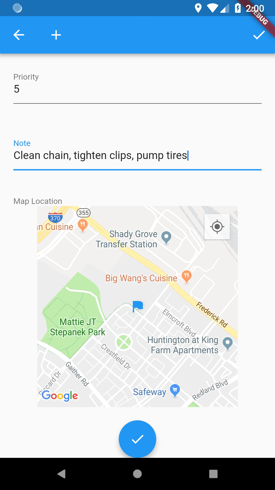
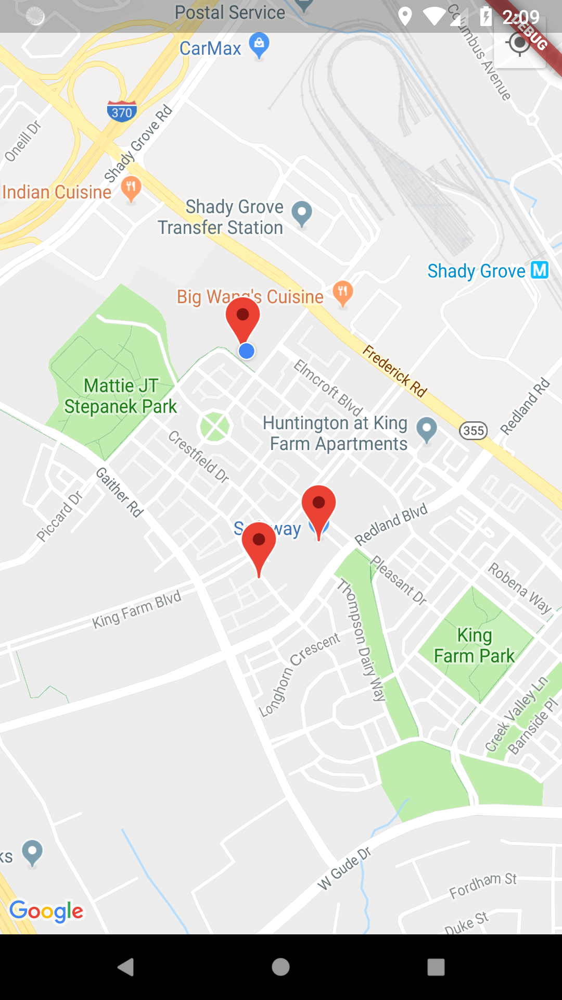

# Add Maps and Location
## TOC
 * [Introduction to Rapido](./introduction.md)
 * [1: Make a complete app with a few lines of code](./flutter_app_in_few_lines.md)
 * [2: Brand and light customization](./customize_flutter_app.md)
 * [3: Input and Display Types](./rapido_input_types.md)
 * [4: Providing your own widgets](./custom_flutter_widgets.md)
 * 5: Adding maps and location
 * [6: Adding images](./flutter_images.md)
 * [7: Document and DocumentList](./rapido_documents.md)
 * [Full Code Example](./main.md)

## Starting Point
At this point we have a fully functional task application that has some of our branding and we've supplied some custom widgets for the individual task items. 


## Adding Your API Key
Currently, Rapido supports Google Maps by wrapping and simplifying the Google Maps Flutter Plugin. In order to use the location and mapping functionality, you will need to supply your own API key. This involves signing up for an API key from Google, and then adding the key to your AndroidManifest.xml file and your AppleDelegate.m file.

See the [Google Maps Flutter Plugin](https://pub.dartlang.org/packages/google_maps_flutter#-readme-tab-) for the detailed instructions. 

## Adding a latlong Field
In [part 1](flutter_app_in_few_lines.md) we defined the labels and by extension the fields, that we expect to include in the UI for Document. We will revisit that by adding a "latlong" field to each Document:
```dart
  DocumentList documentList = DocumentList("Tasker", labels: {
    "Task": "title",
    "Date": "date",
    "Priority": "pri count",
    "Note": "subtitle",
    "Map Location" : "latlong"
  });
```
Like "date" and "count", "latlong" has semantic meaning in Rapido. It means that you want to store a point on a map. (As an aside, there are other field names with semantic, such as "title," which you will see in a bit.)

## Picker UI
After closing the app, and restarting it, if we go through the UI and choose the edit button for a task, you will see that a new field is exposed, named "Map Location." The field is a map that the user can drag around. The flag in the center of the map represents the location that the user would like to choose. By Default, the map starts at the user's current location.


The default ListTile will show the location on a tiny map:  


So there is some default functionality to make sure of the locations after adding a location to each item. But this doesn't help us much in our custom widgets. We should show the map location on our Cards.

This is greatly simplified using Rapido's [TypedDisplayField](https://pub.dartlang.org/documentation/rapido/latest/rapido/TypedDisplayField-html) functionality. Essentially, you pass in any field for a document along with a desired size, and Rapido will convert that into a display widget. Simply slip this line into your custom card:
```
          TypedDisplayField(fieldName: "latlong", document: doc, boxSize: 200.00,),
```
And the map will be displayed for each task that has an associated location.


## Add the Map to the App
It's easy to make a much more interactive experience using Rapido's [DocumentListMapView](https://pub.dartlang.org/documentation/rapido/latest/rapido/DocumentListMapView-class.html) that will display all of the Documents in a [DocumentList](https://pub.dartlang.org/documentation/rapido/latest/rapido/DocumentList-class.html) on a map, assuming that those Documents include a latlong field. So, all we need to do is create a place to display that. We could that with tabs, with a dialog, or in any number of ways. 

We will use the additionalActions property of the [DocumentListScaffold](https://pub.dartlang.org/documentation/rapido/latest/rapido/DocumentListScaffold-class.html) to add a map button to the title bar of the app, and then navigate to a DocumentListMapView.

The additionalActions property is a list of Widgets to display in the title bar. We only need to create one, which will be an IconButton:  
```dart
        IconButton(icon: Icon(Icons.map), onPressed: () {})
```
So the whole build function looks like this:  
```dart
  @override
  Widget build(BuildContext context) {
    return DocumentListScaffold(
      documentList,
      additionalActions: <Widget>[
        IconButton(icon: Icon(Icons.map), onPressed: () {})
      ],
      decoration: BoxDecoration(
        image: DecorationImage(
          image: AssetImage("assets/background.jpg"),
          colorFilter: ColorFilter.mode(
              Colors.white.withOpacity(0.05), BlendMode.dstATop),
        ),
      ),
      emptyListWidget: Center(
        child: Text("Click the add button to create your first task"),
      ),
      customItemBuilder: customItemBuilder,
    );
  }
```
And this added the map button:  


Of course, onPressed is empty so the button doesn't do anything. First, we can create a function that will push a new MaterialPageRoute with a DocumentListMapView.
```dart
void navigateToMap() {
Navigator.push(
    context, MaterialPageRoute(builder: (BuildContext context) {
        return DocumentListMapView(documentList);
    }));
}
```
Then we change the onPressed event for the button to call that function instead:
```dart
    IconButton(icon: Icon(Icons.map), onPressed: navigateToMap),
```
Now when the button is pressed, it displays a map with the Documents:  


It also shows the titles and subtitles if you click on pins:  


This works because of the semantic meaning of "title" and "subtitle" in the Document's fields.

# Summary
This section showed how to add maps and location to your application. It showed, on the way, how to use the additionalActions property of the [DocumentListScaffold](https://pub.dartlang.org/documentation/rapido/latest/rapido/DocumentListScaffold-class.html) to add functionality to your application.


