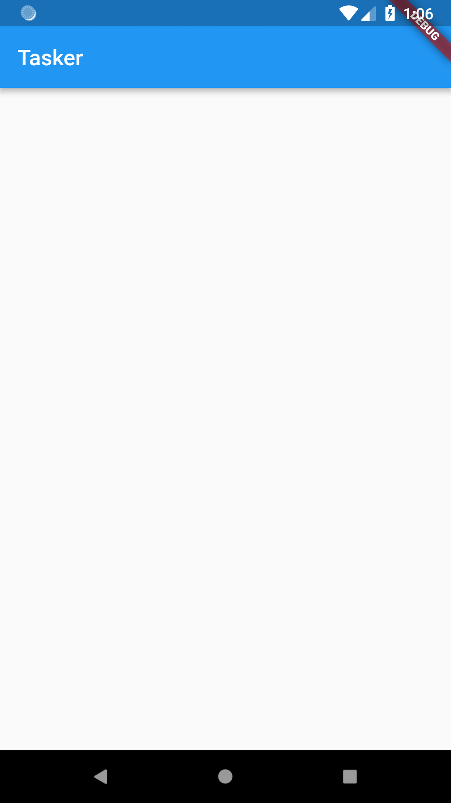
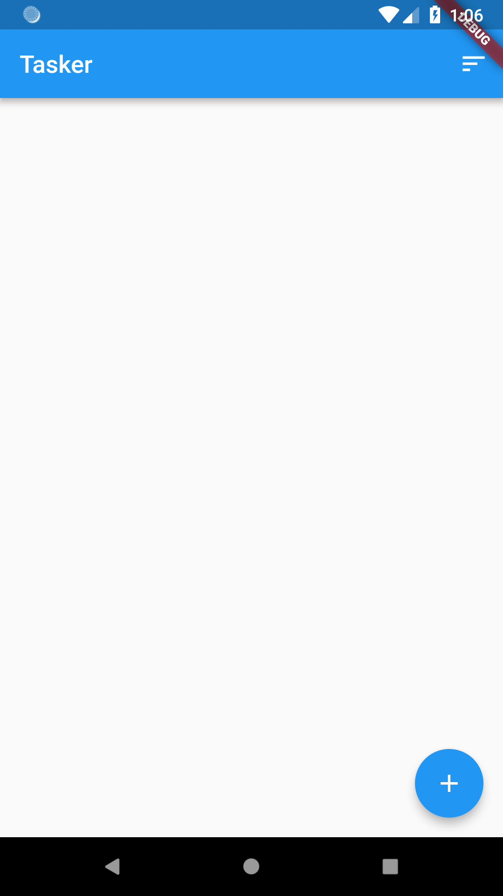
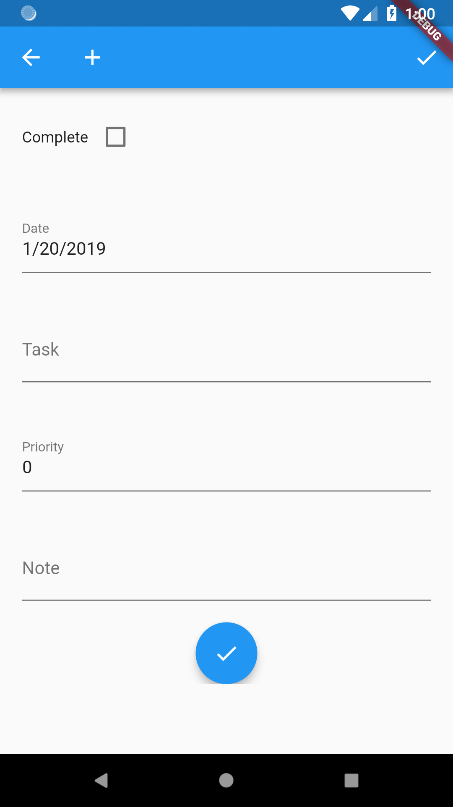
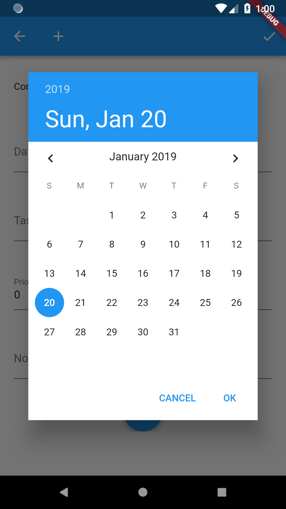
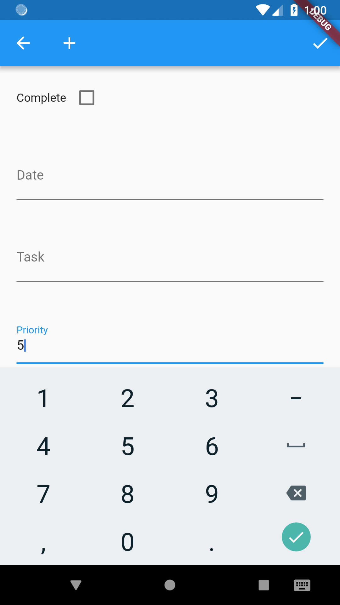
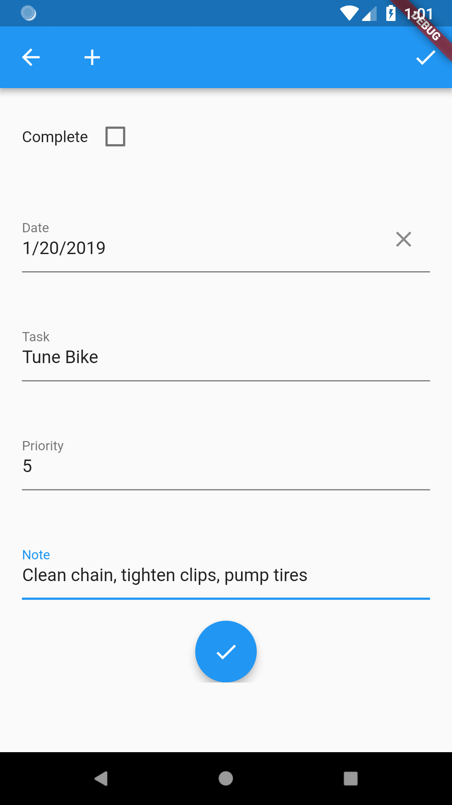

# Tutorial Overview
Maybe you read the (introduction to Rapido)[introduction.md], or maybe you didn't. Either ways is fine, this is where we get to code.

## Pre Reqs
This tutorial assumes that you know what Flutter is, and what Dart the programming language is, but it does not assume that you particularly familar with either. You should probably budget an hour to get the pre reqs set up. Once set up, you shouldn't have any issues.

If you have Flutter running, skip to [creating the project](#create-the-project).

### Flutter Itself
Obviously yuou will need to have Flutter installed. Head over to the [install page](https://flutter.io/docs/get-started/install) and follow directions for your opertaing system. 

### An IDE
While you have a choice of IDEs, I strongly prefer [Visual Studio Code](https://code.visualstudio.com/docs/setup/setup-overview) with the Dart and Flutter extensions installed. Though it is useful to have Android Studio installed for setting up emulators.

### Emulators
Emulators are used for the the run/debug cycle. It is much easier to test your code while you are developing. If you followed the instructions for installing Flutter, than you probably already set up an emulator.

## Create the Project
### Create the Code
We are going to create a task list application, named Tasker. So, first thing is to use your command line to create the Tasker project, like this:

```
$ flutter create tasker
```

Depending on your platform and other factors, you will see some output like this:

```
Creating project tasker...
  tasker/ios/Runner.xcworkspace/contents.xcworkspacedata (created)
  tasker/ios/Runner/Info.plist (created)
  tasker/ios/Runner/Assets.xcassets/LaunchImage.imageset/LaunchImage@2x.png (created)
  tasker/ios/Runner/Assets.xcassets/LaunchImage.imageset/LaunchImage@3x.png (created)
  tasker/ios/Runner/Assets.xcassets/LaunchImage.imageset/README.md (created)
  tasker/ios/Runner/Assets.xcassets/LaunchImage.imageset/Contents.json (created)
  tasker/ios/Runner/Assets.xcassets/LaunchImage.imageset/LaunchImage.png (created)
  tasker/ios/Runner/Assets.xcassets/AppIcon.appiconset/Icon-App-76x76@2x.png (created)
  tasker/ios/Runner/Assets.xcassets/AppIcon.appiconset/Icon-App-29x29@1x.png (created)
  tasker/ios/Runner/Assets.xcassets/AppIcon.appiconset/Icon-App-40x40@1x.png (created)
  tasker/ios/Runner/Assets.xcassets/AppIcon.appiconset/Icon-App-20x20@1x.png (created)
  tasker/ios/Runner/Assets.xcassets/AppIcon.appiconset/Icon-App-1024x1024@1x.png (created)
  tasker/ios/Runner/Assets.xcassets/AppIcon.appiconset/Icon-App-83.5x83.5@2x.png (created)
  tasker/ios/Runner/Assets.xcassets/AppIcon.appiconset/Icon-App-20x20@3x.png (created)
  tasker/ios/Runner/Assets.xcassets/AppIcon.appiconset/Contents.json (created)
  tasker/ios/Runner/Assets.xcassets/AppIcon.appiconset/Icon-App-20x20@2x.png (created)
  tasker/ios/Runner/Assets.xcassets/AppIcon.appiconset/Icon-App-29x29@3x.png (created)
  tasker/ios/Runner/Assets.xcassets/AppIcon.appiconset/Icon-App-40x40@2x.png (created)
  tasker/ios/Runner/Assets.xcassets/AppIcon.appiconset/Icon-App-60x60@3x.png (created)
  tasker/ios/Runner/Assets.xcassets/AppIcon.appiconset/Icon-App-60x60@2x.png (created)
  tasker/ios/Runner/Assets.xcassets/AppIcon.appiconset/Icon-App-76x76@1x.png (created)
  tasker/ios/Runner/Assets.xcassets/AppIcon.appiconset/Icon-App-40x40@3x.png (created)
  tasker/ios/Runner/Assets.xcassets/AppIcon.appiconset/Icon-App-29x29@2x.png (created)
  tasker/ios/Runner/Base.lproj/LaunchScreen.storyboard (created)
  tasker/ios/Runner/Base.lproj/Main.storyboard (created)
  tasker/ios/Runner.xcodeproj/project.xcworkspace/contents.xcworkspacedata (created)
  tasker/ios/Runner.xcodeproj/xcshareddata/xcschemes/Runner.xcscheme (created)
  tasker/ios/Flutter/Debug.xcconfig (created)
  tasker/ios/Flutter/Release.xcconfig (created)
  tasker/ios/Flutter/AppFrameworkInfo.plist (created)
  tasker/test/widget_test.dart (created)
  tasker/tasker.iml (created)
  tasker/.gitignore (created)
  tasker/.metadata (created)
  tasker/ios/Runner/AppDelegate.h (created)
  tasker/ios/Runner/main.m (created)
  tasker/ios/Runner/AppDelegate.m (created)
  tasker/ios/Runner.xcodeproj/project.pbxproj (created)
  tasker/android/app/src/main/res/mipmap-mdpi/ic_launcher.png (created)
  tasker/android/app/src/main/res/mipmap-hdpi/ic_launcher.png (created)
  tasker/android/app/src/main/res/drawable/launch_background.xml (created)
  tasker/android/app/src/main/res/mipmap-xxxhdpi/ic_launcher.png (created)
  tasker/android/app/src/main/res/mipmap-xxhdpi/ic_launcher.png (created)
  tasker/android/app/src/main/res/values/styles.xml (created)
  tasker/android/app/src/main/res/mipmap-xhdpi/ic_launcher.png (created)
  tasker/android/app/src/main/AndroidManifest.xml (created)
  tasker/android/gradle/wrapper/gradle-wrapper.properties (created)
  tasker/android/gradle.properties (created)
  tasker/android/settings.gradle (created)
  tasker/pubspec.yaml (created)
  tasker/README.md (created)
  tasker/lib/main.dart (created)
  tasker/android/app/build.gradle (created)
  tasker/android/app/src/main/java/com/example/tasker/MainActivity.java (created)
  tasker/android/build.gradle (created)
  tasker/android/tasker_android.iml (created)
  tasker/.idea/runConfigurations/main_dart.xml (created)
  tasker/.idea/libraries/Flutter_for_Android.xml (created)
  tasker/.idea/libraries/Dart_SDK.xml (created)
  tasker/.idea/libraries/KotlinJavaRuntime.xml (created)
  tasker/.idea/modules.xml (created)
  tasker/.idea/workspace.xml (created)
Running "flutter packages get" in tasker...                  2.1s
Wrote 64 files.

All done!
[✓] Flutter is fully installed. (Channel beta, v1.0.0, on Mac OS X 10.13.6 17G3025, locale en-US)
[✓] Android toolchain - develop for Android devices is fully installed. (Android SDK 27.0.3)
[!] iOS toolchain - develop for iOS devices is partially installed; more components are available.
    (Xcode 10.1)
[✓] Android Studio is fully installed. (version 3.1)
[✓] VS Code is fully installed. (version 1.29.1)
[✓] Connected device is fully installed. (1 available)

Run "flutter doctor" for information about installing additional components.

In order to run your application, type:

  $ cd tasker
  $ flutter run

Your application code is in tasker/lib/main.dart.
```

### Edit the Generated Code to Create a Blank App
As the output stated, the application code is in the lib directory in the main.dart file. Flutter creates a demo app with tons of comments. If you are like me, you may find this initial outout overwhelming and confusing. 

The first thing I do is edit the application code to dramatically simplify it so it is easier to understand and modify. I also rename the class names while I am at it:

```
import 'package:flutter/material.dart';

void main() => runApp(Tasker());

class Tasker extends StatelessWidget {
  @override
  Widget build(BuildContext context) {
    return MaterialApp(
      title: 'Tasker',
      theme: ThemeData(
        primarySwatch: Colors.blue,
      ),
      home: TaskerHomePage(),
    );
  }
}

class TaskerHomePage extends StatefulWidget {
  TaskerHomePage({Key key}) : super(key: key);

  @override
  _TaskerHomePageState createState() => _TaskerHomePageState();
}

class _TaskerHomePageState extends State<TaskerHomePage> {
  @override
  Widget build(BuildContext context) {
    return Scaffold(
      appBar: AppBar(
        title: Text("Tasker"),
      ),
      body: Container(),
    );
  }
}
```

You can run the code from your IDE, or use the flutter CLI. Assuming you are inside the tasker directory, that would like this:

```
$ flutter run
```

I prefer to use Visual Studio Code's "Run Without Debugging" command.

After running this code, you get a blank application, because the body of the code is simply a blank container.



## Import rapido
### Get the Package
Next step is to import rapido into your project. It is probably wise to visit rapido at [pub.dartlang.org](https://pub.dartlang.org/packages/rapido) to check for the latest version. 

To get a flutter package into your project, you add it to your pubspec.yaml file as a dependency. Be careful with your YAML, it cares a lot about proper indentation. Add a reference to rapido so that your pubspec.yaml looks like this:

```
dependencies:
  flutter:
    sdk: flutter
  rapido: ^0.0.11
```

Again, the indentation levels are very important. If the rapido package on pub.dartlang.org is at a different version than is documented here, use the version on pub.dartlang.org.

It is likely that your IDE has run the "packages get" command for you, but if not, again, assuming you are in the tasker directory, run the command:

```
$ flutter packages get
```

At this point the Rapido package should be available to your code.

### Add the Import Statement
To actually use Rapido in your code, you need to import it into you main.dart file.

Add this import to the top of that file right under the existing import:

```
import 'package:rapido/documents.dart';
```

This means that we are going to use the documents capabilities from the rapido package, which is all that is available so far.

If your IDE says that it can't find the package, than most likely you have not run packages get, or you have problems with indenting in your YAML.

## Define a DocumentList
Now it is finally time to write some code by creating a DocumentList. A DocumentList is an extension of the base List in the Dart language, but it is specialized to only be a list of Documents. This means that any operation that you can do on a normal List in Dart, you can do on a DocumentList as well. However, DocumentList has some extra abilities that are specific to Rapido. You can see the [API documentation](https://pub.dartlang.org/documentation/rapido/latest/documents/DocumentList-class.html) for details, or just plow ahead and see how the code works.

Defining a DocumentList is easy. All you need to do is provide a String as a "documentType". This is simply an identifier that Rapido uses to organize Documents together in the DocumentList. So, you could create a DocumentList like this:

```
  DocumentList documentList DocumentList("Tasker");
```
Then you can start adding Documents to it in code, like this:

```
  documentList.add(Document());
```

This is of limited utility, because you haven't actually added any data. In fact, for this app, we won't be creating Documents directly, but rather we will let Rapido create all of the UI for end users to manage the Documents themselves. 

To do that, we will give the DocumentList a little bit more information. We will tell it what sort of fields to expect in the Documents, but, more importantly, how to show those fields in the UI. We do this by adding a "labels" property to the DocumentList. This is a map where the keys are the labels to show in the user interface, and the values are the keys in the documents. The names of the keys in the documents are important, as you will see soon.

So, let's create a labels property for the DocumentList, and add it to our code for the _TaskerHomePageState:

```
class _TaskerHomePageState extends State<TaskerHomePage> {
  DocumentList documentList = DocumentList("Tasker", labels: {
    "Task" : "title",
    "Date" : "date",
    "Priority" : "pri count",
    "Note" : "note"
  });

  @override
  Widget build(BuildContext context) {

    return Scaffold(
      appBar: AppBar(
        title: Text("Tasker"),
      ),
      body: Container(),
    );
  }
}
```
This says that we are creating a DocumentList, and that the UI should show that there is a Task name, a date, a prioriity field, and a not field. Keep your eye on "date" and "pri count" because you will see how naming the fields in that way is particularly useful.

At this point, if you run that application, there is no change, because we have not created a UI.

## Create the UI
Rapido has a suite of UI components that work with Documents and DocumentLists. The fastest one to use to get your app up and running is called "DocumentListScaffold." This creates all of the UI that you need to the user to manage the data in the app.

So, let's update the code to use the DocumentListScaffold instead of building a Scaffold:

```
class _TaskerHomePageState extends State<TaskerHomePage> {
  DocumentList documentList = DocumentList("Tasker", labels: {
    "Task" : "title",
    "Date" : "date",
    "Priority" : "pri count",
    "Note" : "note"
  });

  @override
  Widget build(BuildContext context) {

    return DocumentListScaffold(documentList);
  }
}
```

Now our code is much simpler, but, now there is much more functionality provided.

### Creation UI
#### Floating Action Button
The DocumentListScaffold creates a DocumentListView, along with a FloatingActionButton for creating documents.  


#### Create Form
The DocumentListView is empty because the DocumentList is empty. But, the user can simply click the add button.  


#### Date Picker
Because you named the field for the date in something that ends in "date," Rapido guesses that you want the user to enter a date for this field, and so creates a date picker automatically.  


#### Integer Picker
Because you named the field for priority in something that ends in "count", Rapido guesses that the user will enter an integer:  


#### Completed Form
The other fields are just assumed to be text:  


#### Fixing the Display
After using the create functionality for 3 tasks, you can see that the list is being populated with the entries. You should also notice that the display is not ideal. We can easily fix that.  


DocumentListScaffold and DocumentListView both allow a lot of customization, some of which will be covered later. For now, we will take advantage of some simple customization in the default ListTile that Rapido creates for each Document. The first property is called "titleKeys." This is a list of Strings which are the key names in the documents that you want in the document row.

So, change the build function to look like this:
```
  @override
  Widget build(BuildContext context) {
    return DocumentListScaffold(
      documentList,
      titleKeys: ["date", "title", "pri count"],
    );
  }
```
This cleans up the UI a lot:  


But, it's not displaying the notes field. We can use the subtitleKey property to tell Rapido to display the note in the subtitle of the default ListTile.
```
  @override
  Widget build(BuildContext context) {
    return DocumentListScaffold(
      documentList,
      titleKeys: ["date", "title", "pri count"],
      subtitleKey: "note",
    );
  }
  ```

And that displays the notes.  


### Sorting


### Add and Delete


