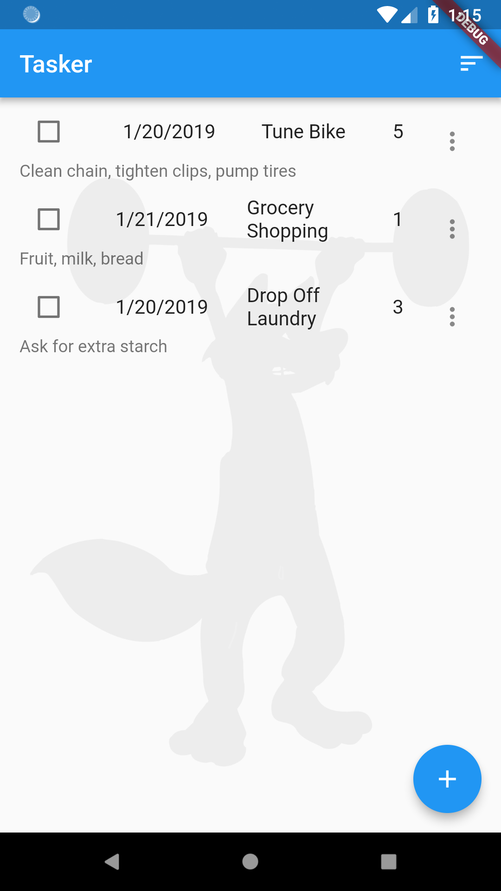

# Tutorial Overview
This is part 3 of the getting started with Rapido tutorial. If you haven't looked through [part 1](get_started_part_1.md) and [part 2](get_started_part_2.md) you might want to at least go back and skim those so this part makes sense.

## Starting Point
At this point, we have a functioning application, and we have applied some branding:  


We've hardly had to write any code to get to this point, because Rapido supplies default implementation for almost all the UI you need. For example, Rapido provides a default ListTile to display in the DocumentListView that comes with the DocumentListScaffold.

Rapido makes it easy to supply your own widgets.

## customItemBuilder
The DocumentListView, and by extension the DocumentListScaffold, have a customItemBuilder property. This property is a function that returns a widget build for each document in the list. In this way, you can write a function to replace the default ListTile. Note that if you supply a customItemBuilder function, the titleFields and subtitleField properties are ignored.

We'll start with a very simple customWidgetBuilder:  
```
  Widget customItemBuilder(int index, Document doc, BuildContext context){
        return Text(doc["title"]);
  }
  ```
This function is called for each item in the DocumentList, and returns a Text with the title as the text.

Of course, we need to set the customItemBuilder proprty to use it:
```
  @override
  Widget build(BuildContext context) {
    return DocumentListScaffold(
      documentList,
      decoration: BoxDecoration(
        image: DecorationImage(
          image: AssetImage("assets/background.jpg"),
          colorFilter: ColorFilter.mode(
              Colors.white.withOpacity(0.05), BlendMode.dstATop),
        ),
      ),
      emptyListWidget: Center(
        child: Text("Click the add button to create your first task"),
      ),
      customItemBuilder: customItemBuilder,
    );
  }

  Widget customItemBuilder(int index, Document doc, BuildContext context) {
    return Text(doc["title"]);
  }
  ```
It's working, but, of course, much worse than the default:  


## Build a Card

## Set the Color Dynamically

## Reuse DocumentActionsButton

# Summary
