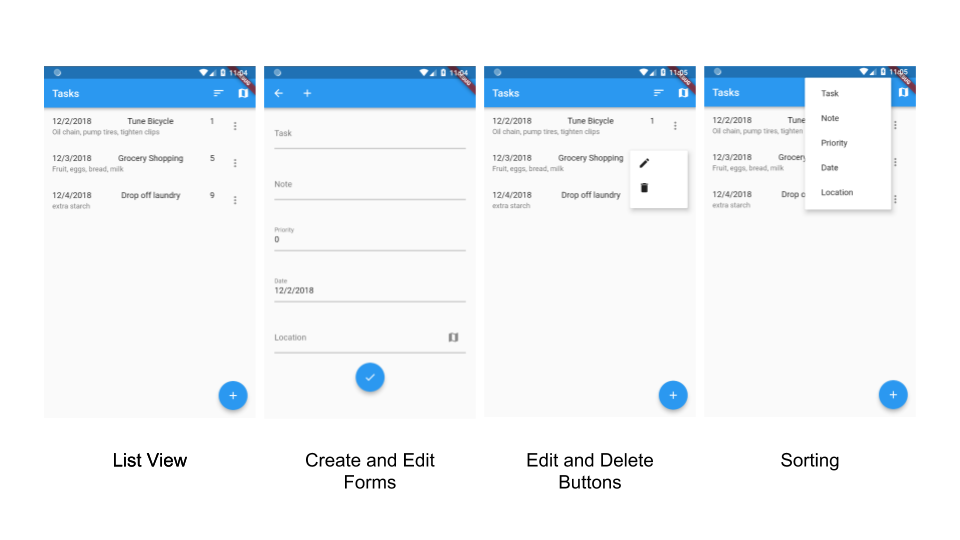

# Introduction to Rapido
## TOC
 * Introduction to Rapido
 * [1: Make a complte app with a few lines of code](./get_started_part_1.md)
 * [2: Brand and light customization](./get_started_part_2.md)
 * [3: Providing your own widgets](./get_started_part_3.md)
 * [4: Adding maps and location](./get_started_part_4.md)

# Introduction to Rapido
Rapido is an open source libraruy that intends to make cross platform development easy and fun. We do this by taking a document-centric approach to development, and by following Rapid Application Development (RAD) principles whenever possible.

Skip this page and head to the [tutorial](get_started_part_1.md) if you just want to get to the code. 

## What do you mean by "document-centric?"
Many, if not most, applications are centered around a collection of data, whether entered by the the user, or from a central source, often, but not always, on the Internet somehwere. Applications are designed to allow users to create, retrieve, update, and delete this data, or perform some subset of these actions. In a document centric view, each "entity" that the user can perform these actions on, along with the properties of those  is considered a "document."

Take, for example, an application that allows users to collaborate on listing good places to eat in a city for people who cannot eat gluten. Each document would be a restaurant, and it would have certain properties such as address, ratings, an image etc...

In code, each document is represented as a Map with each property having a string for the key, and some other data type for the value. This would be called a dictionary in Python, or an Object in Javascript.

## What is RAD?
Rapid Application Development means that, as a developer, you should get a lot of functionality for not very much work. However, this should not come at the expense of power and flexibility. RAD means that you should only be spending your time as a developer focused on the parts of your application that are unique.

## What does Rapido do for you?
With Rapido, all you need to do is define the kind of documents that you want in a very easy way, and rapido will provide all of the UI that your users need to interact with those documents at run time. 

### Just show me some code already
In a nutshell, Rapido let's you define documents you care about in a simple way. Either by simply creating documents, or you can define labels for those documents in the UI. The latter way is handy if your app starts without any documents.

In this code, we are creating a [DocumentList](https://pub.dartlang.org/documentation/rapido/latest/documents/DocumentList-class.html), which, you may guess, is a list of documents. As we create the list, we are supplying some optional information for how we want to display the fields of the documents in the UI:

```
  DocumentList documentList = DocumentList(
    "Mapped Task List",
    labels: {
      "Task": "title",
      "Note": "subtitle",
      "Priority": "pri count",
      "Date": "date"
    },
  );
  ```

  This is enough information for Rapido to create all of the UI that users need to manage those documents. The easiest way is to use a [DocumentListScaffold](https://pub.dartlang.org/documentation/rapido/latest/documents/DocumentListScaffold-class.html), which will create all the UI all at once:

  ```
  @override
  Widget build(BuildContext context) {
    return DocumentListScaffold(
      documentList,
      title: "Tasks",
      titleKeys: ["date", "title", "pri count"],
      subtitleKey: "subtitle",
    );
  }
  ```
This code creates this full application:


This will make a lot more sense if you look at the code, so head over to the [tutorial](get_started_part_1.md).
