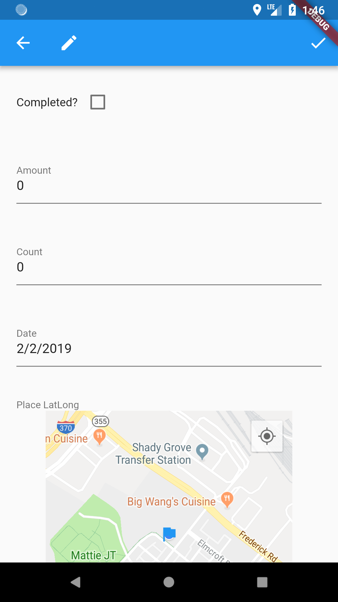

# Input and Display Types
## TOC
 * [Introduction to Rapido](./introduction.md)
 * [1: Make a complete app with a few lines of code](./flutter_app_in_few_lines.md)
 * [2: Brand and light customization](./customize_flutter_app.md)
 * 3: Input and Display Types
 * [4: Providing your own widgets](./custom_flutter_widgets.md)
 * [5: Adding maps and location](./flutter_maps_and_location.md)
 * [6: Adding images](./flutter_images.md)
 * [7: Document and DocumentList](./rapido_documents.md)
 * [Full Code Example](./main.md)

## Summary
When you define a field in a Document or DocumentList, Rapido infers a lot from the way the you name the field. It looks at the end of the field name, and guesses what type is desired from that name. 

All the available inferred types are summarized in the table below.  

| Field Name Ends In  | Inferred Dart Type | Default Input Type | Display Type | Field Options |
| ------------- | ------------- | ------------- | ------------- | | ------------- |
| ? | bool | Checkbox | Checkbox | none |
| amount | double | TextInput with numbered keyboard | Text | AmountFieldOptions |
| count | int | TextInput with numbered keyboard, only accepts digits | Text | IntegerPickerFieldOptions |
| date | DateTime | TextInput with date picker | Text | DateTimeFieldOptions |
| datetime | DateTime | TextInput with date picker | Text | DateTimeFieldOptions |
| image | String | Image picker, on device and URLs supported | Image | none |
| latlong | Map<String, double> | Map picker | Map | none |
| text | String | Multi-line input | String | none |
| | String | Any other value is assumed to be a String | String | |

## Defining Your Fields
There are two ways to tell your DocumentList what fields the Documents it contain will have, explicitly and implicitly.

### Explicit Definition
You explicitly define your fields in a DocumentList using the lables property. This is a map of strings to strings (i.e. Map<String, String>). The keys (the first string) are the labels that you want to show in the UI, and the values are the field names that you want to use internally. This is useful because you can use any term that makes sense to users in the UI, and use whatever field name makes sense to users internally.

```dart
    final DocumentList documentList = DocumentList(
    "tasker",
        labels: {
            "Checked": "?",
            "Decimal Number": "amount",
            "Intenger Number": "count",
            "Start Date": "date",
            "End Time": "datetime",
            "Picture": "image",
            "Map Location": "latlong",
            "Long Description": "text",
        },
    );
```

If we use this DocumentList in a DocumentListScaffold or DocumentListView, Rapido will then create the specific UI for each field.

You can see that it renders the UI labels that you defined in the label keys, but knows the appropriate input types based on the values:  
  
  

Rapido adds the appropriate input UI for differet types. Notice that the first field is a checkbox, for instance. Further examples include numbers keyboard:  
 

Dates and datetime get the date and time pickers:  


Images supports the camera, gallery, and URL inputs:  


Multiline text field is created:  


### Implicit Definition
Defining a lables property is useful, but not required. If the labels property is not defined, then Rapido will create it automatically from the first Document in the DocumentList. When inferring types, Rapdio ignores capitalization. 

In the following code, instead of using labels, the code adds a Document with appropriately named fields:

```dart
 final DocumentList documentList = DocumentList(
    "tasker",
    initialDocuments: [
      Document(initialValues: {
        "Completed?": false,
        "Amount": 0,
        "Count": 0,
        "Date": null,
        "Place LatLong": null,
        "Image": null,
        "text": "this can be long if desiered"
      }),
    ],
  );
```

The Document is added to the list as per normal.


Now the DocumentListScaffold uses the field names to create an appropriate DocumentForm:  
 

## Field Options
Rapido makes good use of inferences to quickly create a UI for basic CRUD operations with very little coding. However, there may be cases where you would like to give Rapido "hints" so it can create a more tailored UI. Rapido uses FieldOptions for this. The full list of supported FieldOptions is available in the table above.

### Setting FieldOptions
Field options are set via the FieldOptionsMap property of a DocumentList or DocumentListScaffold. This will be clear in the examples below.

### IntegerPickerFieldOptions
IntegerPickerFieldOptions allows you to set a minimum and maximum. When both of these are set, Rapido will provide a spinner picker instead of a text input field:  
```dart
    final DocumentList documentList = DocumentList(
    "tasker",
        labels: {
            "Intenger Number": "count",
        },
        fieldOptionsMap: {"count":IntegerPickerFieldOptions(1, 10)}
    );
```

 

### InputListFieldOptions 
If you want the user to choose from a list of strings, you can achieve this by using the InputListFieldOptions for a field. This takes three inputs, a document type string for an existing DocumentList that holds the values you want to display in the list, a field name from that DocumentList for the value to display, and a field name for the value that you actually want to save. 

```dart
class TaskerHomePage extends StatefulWidget {
  TaskerHomePage({Key key}) : super(key: key);
  final DocumentList inputList = DocumentList(
    "task types",
    initialDocuments: [
      Document(initialValues: {"name": "Shopping"}),
      Document(initialValues: {"name": "House Work"}),
      Document(initialValues: {"name": "Errands"}),
      Document(initialValues: {"name": "School"}),
    ],
  );

    final DocumentList documentList = DocumentList(
    "tasker",
        labels: {
            "Task Type": "type",
        },
        fieldOptionsMap: {"type":InputListFieldOptions("task types", "name", "name")}
    );
```

This results in a list that the user can spin through and make a choice:  
 

You can supply up to one FieldOption per field:  
```dart
  final DocumentList documentList = DocumentList("tasker", labels: {
    "Intenger Number": "count",
    "Type": "type"
  }, fieldOptionsMap: {
    "count": IntegerPickerFieldOptions(1, 10),
    "type": InputListFieldOptions("task type", "name", "name")
  });
```