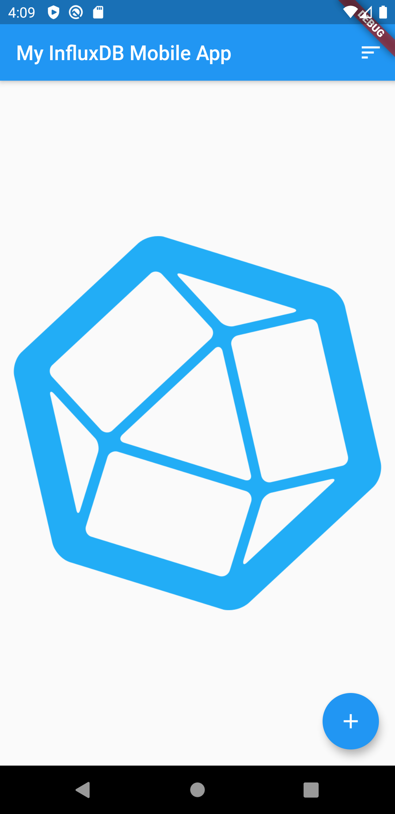
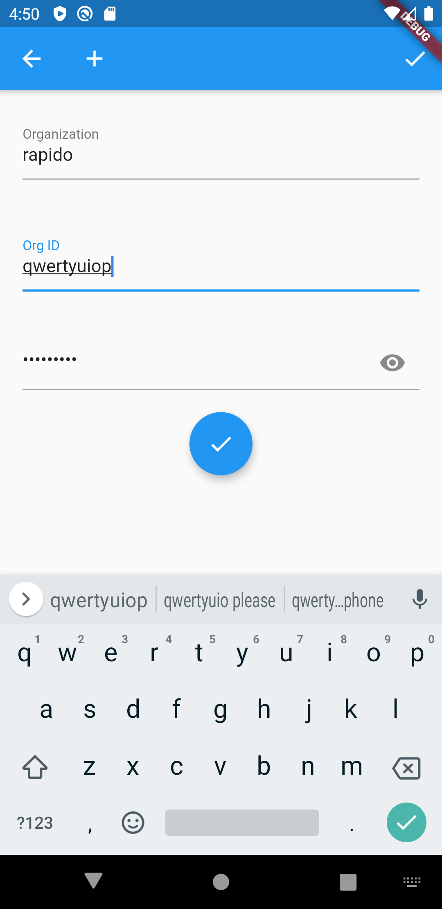
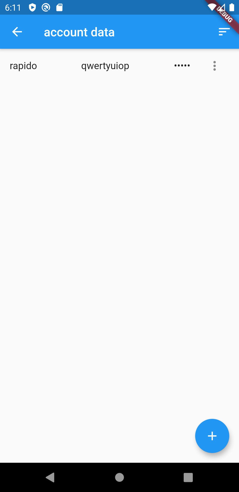

# Input and Display Types
## TOC
 * [Introduction to Rapido](./introduction.md)
 * [1: Make a complete app with a few lines of code](./flutter_app_in_few_lines.md)
 * [2: Brand and light customization](./customize_flutter_app.md)
 * [3: Input and Display Types](./tutorials/rapido_input_types.md)
 * [4: Providing your own widgets](./custom_flutter_widgets.md)
 * [5: Adding maps and location](./flutter_maps_and_location.md)
 * [6: Adding images](./flutter_images.md)
 * [7: Document and DocumentList](./rapido_documents.md)
 * 8: Storing Secrets 
 * [Full Code Example](./main.md)

## Summary
By default, a [DocumentList](https://pub.dartlang.org/documentation/rapido/latest/rapido/DocumentList-class.html) is a great way to manage a fairly large amount of content for a user. However, the documents are saved in clear text JSON in the default directory of the user's device. Normally, this is just fine. However, this is not ideal for things like passwords and tokens, as those are secrets that should not be stored as pure text.

Rapido manages this problem easily by providing a [PersistenceProvider](https://pub.dev/documentation/rapido/latest/rapido/PersistenceProvider-class.html) called [SecretsPersistence](https://pub.dev/documentation/rapido/latest/rapido/SecretsPercistence-class.html) that stores data in the device's secret store. Additionally, by using the word "secret" in the field names of the documents, Rapido will automatically provide a password field experience that users will expect for entering data, and will automatically mask the field when displaying it.

## Example with a single account
Let, say, for example, that you are writing an application that interacts with InfluxDB Cloud's API. For most function calls, you will need 3 things:
1. The user's organization name, which is not a secret.
2. The user's organization id, also not a secret.
3. An API token, which is absolutely a secret.

### Starting Point
We can start the application simply, with an empty [DocumentList](https://pub.dartlang.org/documentation/rapido/latest/rapido/DocumentList-class.html), since the focus of this tutorial will be on storing the API token, not the application data.

```dart
class MyHomePage extends StatefulWidget {
  MyHomePage({Key key, this.title}) : super(key: key);

  final String title;

  @override
  _MyHomePageState createState() => _MyHomePageState();
}

class _MyHomePageState extends State<MyHomePage> {
  DocumentList documentList = DocumentList("influxDBDocs");

  @override
  void initState() {
    super.initState();
  }

  @override
  Widget build(BuildContext context) {
    return DocumentListScaffold(
      documentList,
      title: widget.title,
      decoration: BoxDecoration(
        image: DecorationImage(image: AssetImage("assets/background.png")),
      ),
    );
  }
}
```
This produces the following blank application:


### Add a DocumentList for the User Data
In the next step, we add a new [DocumentList](https://pub.dartlang.org/documentation/rapido/latest/rapido/DocumentList-class.html) for the user data. Because of the async nature of Flutter, it is easiest to declare the DocumentList normally, but to actually instantiate it inside the initState function so that we can retrigger the build function when the [DocumentList](https://pub.dartlang.org/documentation/rapido/latest/rapido/DocumentList-class.html) is done loading.

Note the following important concepts below:
 * userList is created with a [SecretsPersistence](https://pub.dev/documentation/rapido/latest/rapido/SecretsPercistence-class.html) PersistenceProvider instead of using the default. This tells Rapido to use the device's secrets store. This is all that you need to do in order to store the contents securely.
 * The token field is called "token secret" because ending the field name with "secret" tells Rapido to use appropriate UI elements when building forms and displaying the content.
 * The onLoadComplete event calls setState in order to tell the home page to rebuild itself when userList is done loading. Otherwise, the home page will go ahead and render, and never know that the userList was loaded.

```dart
class _MyHomePageState extends State<MyHomePage> {
  DocumentList documentList = DocumentList("influxDBDocs");

  DocumentList userList;

  @override
  void initState() {
    userList = DocumentList("account data",
        persistenceProvider: SecretsPercistence(),
        labels: {
          "Organization": "org",
          "Org ID": "orgid",
          "Token": "token secret"
        },
        onLoadComplete: ((){
          setState(() {});
        }),
        );
    super.initState();
  }

  @override
  Widget build(BuildContext context) {
    return DocumentListScaffold(
      documentList,
      title: widget.title,
      decoration: BoxDecoration(
        image: DecorationImage(image: AssetImage("assets/background.png")),
      ),
    );
  }
}
```

### Add UI to Show the State of userList
userList could either be null, meaning it is still loading, empty, meaning the user the has not added any account data, or not empty, meaning that there is account data. You can use the [emptyListWidget](https://pub.dev/documentation/rapido/latest/rapido/DocumentListView/emptyListWidget.html) property to show that state.

An easy way to do this is by using the "ternary operator." If you haven't seen this before, don't worry, it is easy to read. It is in the form:

```
condition ? return if condition is true : return if condition is false
```
So, you can read the "?" as then, and the ":" as else. This example is nested, so it goes: "if userLlist is null then return a progress indicator, else if the userList length is zero, return one prompt, else return a different prompt."

```dart
  @override
  Widget build(BuildContext context) {
    return DocumentListScaffold(
      documentList,
      emptyListWidget: userList == null
          ? Center(child: CircularProgressIndicator())
          : userList.length == 0
              ? Center(
                  child: Text("Add an account to start"),
                )
              : Center(
                  child: Text("Click the plus button to start"),
                ),
      title: widget.title,
      decoration: BoxDecoration(
        image: DecorationImage(image: AssetImage("assets/background.png")),
      ),
    );
  }
```


### Add UI for Account Creation
It's nice that there is a prompt to add an account, but there is no UI for doing so. First, we will add an account button, and then add a form.

The easiest way to allow the user to open a form, is to add an icon button to the app bar. Fortunately, there is a property in [DocumentListScaffold](https://pub.dev/documentation/rapido/latest/rapido/DocumentListScaffold-class.html), specifically for this, the [additionalActions](https://pub.dev/documentation/rapido/latest/rapido/DocumentListScaffold/additionalActions.html) property. This allows you to pass in a list of Widgets to add to the app bar. 

Adding the following to the Scaffold, add the person icon as seen in the screenshot below.
```dart
additionalActions: <Widget>[IconButton(icon: Icon(Icons.person), onPressed: null)],
```


Obviously, since the onPressed function is null, nothing will happen. So, let's some code to display a [DocumentForm](https://pub.dev/documentation/rapido/latest/rapido/DocumentForm-class.html) when that button is clicked.

If you create a [DocumentForm](https://pub.dev/documentation/rapido/latest/rapido/DocumentForm-class.html) without a document property set or with document set to null, the [DocumentForm](https://pub.dev/documentation/rapido/latest/rapido/DocumentForm-class.html) will create a new [Document](https://pub.dev/documentation/rapido/latest/rapido/Document-class.html), and add it to the DocumentList. If you include a [Document](https://pub.dev/documentation/rapido/latest/rapido/Document-class.html), then the form will edit that document instead.

Again, the ternary operator makes this easy. You can read the code below as "if userList.length equal zero, then the document is null, else, the document is the first index in userList."

```dart
document: userList.length == 0 ? null : userList[0],
```

In the full builder function below, note that the code uses "await" to block on the Navigator.push function, and then calls setState() to call build again after the form is dismissed. In this way, the code can pick up changes in the userList.

```dart
 Widget build(BuildContext context) {
    return DocumentListScaffold(
      documentList,
      emptyListWidget: userList == null
          ? Center(child: CircularProgressIndicator())
          : userList.length == 0
              ? Center(
                  child: Text("Add an account to start"),
                )
              : Center(
                  child: Text("Click the plus button to add something"),
                ),
      additionalActions: <Widget>[
        IconButton(
          icon: Icon(Icons.person),
          onPressed: (() async {
            await Navigator.push(
              context,
              MaterialPageRoute(
                builder: (BuildContext context) {
                  return DocumentForm(
                    userList,
                    document: userList.length == 0 ? null : userList[0],
                  );
                },
              ),
            );
            setState(() {});
          }),
        ),
      ],
      title: widget.title,
      decoration: BoxDecoration(
        image: DecorationImage(image: AssetImage("assets/background.png")),
      ),
    );
  }
  ```
Let's see how this works.

First, when the user clicks the user button in the application bar, the form appears. Notice that the Token field has the eye icon. That's because the field name was "token secret", so Rapido knows to provide a hidden field.


And when the token is entered, it is hidden as expected, unless the user toggles visibility with the eye button.


Finally, when the user clicks the check mark, the page knows that an account is set, and it is ready for the next steps.


Now that there is account information added, you could go on to use it query the API end points. For an example of how to do that, you can see the tutorial on [Document and DocumentList](./rapido_documents.md)

## Example for multiple accounts
In the previous example, the application only supported a single user account. But what if the application needs to store multiple accounts? With Rapido, this is not only possible, but is actually slightly easier than using only a single account.

In order to support multiple accounts, simply change the onPressed function to return a [DocumentListScaffold](https://pub.dev/documentation/rapido/latest/rapido/DocumentListScaffold-class.html).

```dart
          onPressed: (() async {
            await Navigator.push(
              context,
              MaterialPageRoute(
                builder: (BuildContext context) {
                  return DocumentListScaffold(
                    userList,
                  );
                },
              ),
            );
            setState(() {});
          }),
```

Now when the user clicks the button, they get a list of their accounts:


Notice that the token field is hidden. That's because Rapido knows not to display a field ending in "secret."

You can provide a different user experience by using all of the power of [DocumentListScaffold](https://pub.dev/documentation/rapido/latest/rapido/DocumentListScaffold-class.html) here. For example, you can see how to use a [custom item builder](./custom_flutter_widgets.md) to make a unique user experience for managing multiple accounts.